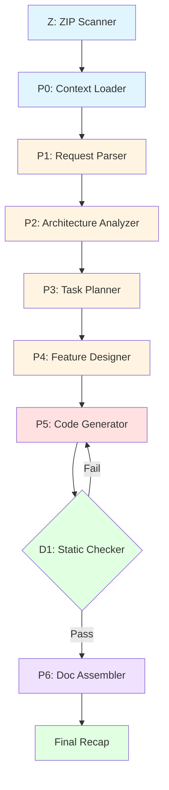

<div align="center">

# ⚡ Aurora AI Refactor Assistant

### *Next-Generation Autonomous Code Refactoring Powered by Multi-Agent Orchestration*

[](https://www.python.org/downloads/)
[](https://opensource.org/licenses/Apache-2.0)
[](https://github.com/astral-sh/ruff)
[](http://mypy-lang.org/)
[](https://docs.python.org/3/library/asyncio.html)

**[Features](#-key-features)** •
**[Quick Start](#-quick-start)** •
**[Architecture](#-architecture)** •
**[Examples](#-usage-examples)** •
**[Contributing](#-contributing)**

---

</div>

## 🎯 The Vision

**Stop wasting hours on repetitive refactoring tasks.** Aurora is an enterprise-grade AI assistant that automatically analyzes your codebase, plans complex refactoring operations, generates production-ready patches, and validates every change with military-grade safety guarantees.

Unlike traditional code assistants that generate code blindly, Aurora orchestrates **7 specialized AI agents** through a deterministic pipeline—ensuring consistency, safety, and excellence in every transformation.

---

## 🚀 Why Aurora?

### The Problem
Large codebases require constant maintenance: adding logging, updating dependencies, refactoring patterns, fixing security issues. These tasks are:
- ⏰ **Time-consuming** – Manual refactoring takes hours or days
- 🐛 **Error-prone** – Easy to miss edge cases or introduce bugs
- 🔄 **Repetitive** – Same patterns across hundreds of files
- 🎯 **Risky** – Changes can break existing functionality

### The Aurora Solution
Aurora transforms refactoring from a manual chore into an **autonomous, validated, and transparent process**:

✅ **Multi-Agent Intelligence** – 7 specialized agents coordinate seamlessly
✅ **Safety First** – Built-in static analysis, import validation, and syntax checking
✅ **Async Performance** – Lightning-fast execution with concurrent operations
✅ **Beautiful UX** – Rich terminal UI with progress indicators and colored output
✅ **Production Ready** – Docker support, structured logging, comprehensive testing
✅ **Fully Typed** – 100% type hints with strict mypy validation

---

## ✨ Key Features

<table>
<tr>
<td width="50%">

### 🤖 Multi-Agent Orchestration
- **7 Specialized Agents** working in concert
- **Deterministic Pipeline** (Z → P0 → P1 → P2 → P3 → P4 → P5 → D1 → P6)
- **Shared Memory** blackboard pattern for data flow
- **Self-Healing** code generation with validation loops

</td>
<td width="50%">

### ⚡ Modern Architecture
- **100% Async** using asyncio for maximum performance
- **Type Safe** with complete mypy strict mode compliance
- **Pydantic V2** for configuration and validation
- **Structured Logging** with JSON output support

</td>
</tr>
<tr>
<td width="50%">

### 🎨 Beautiful CLI
- **Typer + Rich** for stunning terminal UI
- **Progress Indicators** with spinners and status updates
- **Colored Output** with syntax highlighting
- **Self-Documenting** help system

</td>
<td width="50%">

### 🔒 Enterprise Grade
- **Security Audits** with Bandit integration
- **Docker Support** with multi-stage builds
- **Health Checks** and observability
- **Production Logging** with structlog

</td>
</tr>
</table>

---

## 📦 Quick Start

### Installation

Aurora uses **[uv](https://github.com/astral-sh/uv)** for lightning-fast dependency management:

```bash
# Install uv (if not already installed)
curl -LsSf https://astral.sh/uv/install.sh | sh

# Clone the repository
git clone https://github.com/ruslanmv/ai-project-features.git
cd ai-project-features

# Install Aurora
make install

# Or install with dev dependencies
make install-dev
```

### Configuration

Create a `.env` file with your IBM Watson X.ai credentials:

```bash
# Watson X.ai Configuration
WATSONX_API_KEY=your_api_key_here
WATSONX_PROJECT_ID=your_project_id
WATSONX_URL=https://us-south.ml.cloud.ibm.com

# Optional: Customize behavior
DEFAULT_LLM_MODEL_ID=granite-20b-chat
LLM_TEMPERATURE=0.2
LOG_LEVEL=INFO
```

### Validate Setup

```bash
aurora validate-config
```

---

## 🎯 Usage Examples

### Basic Refactoring

```bash
# Add logging to all functions
aurora refactor project.zip "Add comprehensive logging to all functions"

# Update dependencies
aurora refactor app.zip "Update all dependencies to latest versions"

# Add type hints
aurora refactor codebase.zip "Add type hints to all Python files"
```

### Advanced Options

```bash
# Use specific model and temperature
aurora refactor \
  --model granite-20b-chat \
  --temperature 0.0 \
  project.zip \
  "Refactor error handling to use custom exceptions"

# Save output to file
aurora refactor \
  --output refactored.md \
  app.zip \
  "Add OpenTelemetry tracing"

# Quiet mode with JSON logs (perfect for CI/CD)
aurora refactor \
  --quiet \
  --json-logs \
  project.zip \
  "Fix security vulnerabilities"
```

### Programmatic Usage

```python
import asyncio
from aurora.core.orchestrator import RefactorOrchestrator

async def main():
    orchestrator = RefactorOrchestrator()

    # Optional: Set progress callback
    async def on_progress(phase: str, status: str):
        print(f"{phase}: {status}")

    orchestrator.set_progress_callback(on_progress)

    # Run refactoring
    result = await orchestrator.run(
        zip_path="project.zip",
        user_prompt="Add comprehensive docstrings"
    )

    print(result)

asyncio.run(main())
```

---

## 🏗️ Architecture

Aurora follows a **deterministic multi-phase pipeline** with specialized agents for each responsibility:



### Phase Breakdown

| Phase | Agent | Responsibility |
|-------|-------|---------------|
| **Z** | File Scanner | Deterministic ZIP analysis and tree generation |
| **P0** | Context Loader | Store user prompt and context in shared memory |
| **P1** | Request Parser | Extract structured constraints from natural language |
| **P2** | Architecture Analyzer | Analyze codebase patterns and architecture |
| **P3** | Task Planner | Decompose work into ordered, actionable tasks |
| **P4** | Feature Designer | Design implementation approach |
| **P5** | Code Generator | Generate production-ready code patches |
| **D1** | Static Checker | Validate syntax, imports, and type safety |
| **P6** | Doc Assembler | Generate comprehensive markdown recap |

### Safety Guarantees

🔒 **AST Validation** – No dangerous top-level exec statements
🔒 **Syntax Checking** – Python compilation validation
🔒 **Import Validation** – All imports must resolve
🔒 **Retry Logic** – Up to 4 attempts for code generation
🔒 **Timeout Protection** – Global timeout prevents runaway execution

---

## 🛠️ Development

### Run Tests

```bash
# Full test suite with coverage
make test

# Fast tests without coverage
make test-fast

# Watch mode for TDD
make test-watch
```

### Code Quality

```bash
# Run complete audit (lint + typecheck + security + tests)
make audit

# Individual checks
make lint        # Ruff linter
make format      # Auto-format code
make typecheck   # MyPy type checking
make security    # Bandit security scan
```

### Docker

```bash
# Build image
make docker-build

# Run in container
make docker-run

# Interactive shell
make docker-shell
```

---

## 📊 Project Structure

```
aurora-refactor/
├── src/aurora/              # Source code (Clean Architecture)
│   ├── __init__.py         # Package metadata
│   ├── cli/                # Command-line interface
│   │   └── main.py         # Typer CLI application
│   ├── core/               # Core infrastructure
│   │   ├── config.py       # Pydantic V2 settings
│   │   ├── logging.py      # Structured logging
│   │   ├── memory.py       # Shared memory/blackboard
│   │   ├── exceptions.py   # Exception hierarchy
│   │   └── orchestrator.py # Main workflow coordinator
│   ├── agents/             # AI agents (one per phase)
│   │   ├── base.py         # Abstract base agent
│   │   ├── request_parser.py
│   │   ├── task_planner.py
│   │   └── ...
│   ├── tools/              # Utilities and helpers
│   │   └── file_scanner.py
│   └── api/                # Optional API server
├── tests/                  # Comprehensive test suite
├── Makefile                # Self-documenting commands
├── Dockerfile              # Production-ready container
├── pyproject.toml          # Project configuration (uv-compatible)
└── README.md               # This file
```

---

## 🤝 Contributing

We welcome contributions from the community! Please see [CONTRIBUTING.md](CONTRIBUTING.md) for guidelines.

### Quick Contribution Guide

1. **Fork** the repository
2. **Create** a feature branch (`git checkout -b feature/amazing-feature`)
3. **Make** your changes
4. **Run** `make audit` to ensure quality
5. **Commit** with clear messages (`git commit -m 'Add amazing feature'`)
6. **Push** to your fork (`git push origin feature/amazing-feature`)
7. **Open** a Pull Request

---

## 📝 License

This project is licensed under the **Apache License 2.0** - see the [LICENSE](LICENSE) file for details.

Free for commercial and academic use. Attribution appreciated but not required.

---

## 👤 Author

**Ruslan Magana**

- Website: [ruslanmv.com](https://ruslanmv.com)
- GitHub: [@ruslanmv](https://github.com/ruslanmv)

---

## 🌟 Acknowledgments

Built with world-class open-source tools:

- [IBM Watson X.ai](https://www.ibm.com/watsonx) – Foundation models
- [Pydantic V2](https://docs.pydantic.dev/) – Data validation
- [Typer](https://typer.tiangolo.com/) – Beautiful CLIs
- [Rich](https://rich.readthedocs.io/) – Terminal formatting
- [uv](https://github.com/astral-sh/uv) – Fast package management
- [Ruff](https://github.com/astral-sh/ruff) – Lightning-fast linting
- [structlog](https://www.structlog.org/) – Structured logging

---

## 📈 Roadmap

- [ ] **Web UI** – Visual refactoring interface
- [ ] **More LLM Providers** – OpenAI, Anthropic, Cohere support
- [ ] **Plugin System** – Custom agent extensions
- [ ] **VSCode Extension** – IDE integration
- [ ] **Diff Visualization** – Interactive code comparison
- [ ] **Team Collaboration** – Share refactoring sessions

---

<div align="center">

**⚡ Built with passion for world-class software engineering ⚡**

If Aurora makes your development easier, **give it a star** ⭐

[Report Bug](https://github.com/ruslanmv/aurora-refactor/issues) •
[Request Feature](https://github.com/ruslanmv/aurora-refactor/issues) •
[Join Discussion](https://github.com/ruslanmv/aurora-refactor/discussions)

</div>
